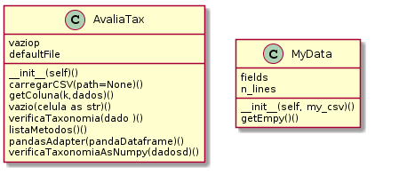

# Entrega das atividades

## Grupo

- Felipe
- Wana
- Andre
- Alexandre

## Progresso

Os detalhes estão em:

https://github.com/felipexp8/Avaliando_qualidade_dados_de_ocorrencia/projects/1

## Relatório

- Item 1 Adicionado. Opera com Pandas
- Item 2 Adicionado. Opera com Numpy
  - Por padrão os dados de entradas são listas com str()
  - Tem adaptador de Pandas para List()
- Item 3 Adicionado. Opera com Pandas
  - Suporta _True Color_ no console 

Adicionado o diagrama de classes, ainda está fora da norma... A class AvaliaTax tem seus métodos estáticos (podem ser chamados sem instanciar)

## UML

Pedaços de UML das classes dos itens 1 e 2. 



## Dúvidas frequentes

Esta classe utiliza métodos estáticos @staticmethod
Estes métodos podem ser acessados fora dos objetos, como se fosse uma função solta. Equivale ao agrupando das funçoes para não ficaram perdidas no escopo ao importar para outros arquivos, praticamente é um módulo.
```
 exemplo: from AvaliaTax import * 
 meusDados = leiaTudo(arquivo)
 AnaliaTax.verificaTaxonomia(meusDados)
 
 # Não precisa fazer:
 meuObjeto = AvaliaTax()
 # e depois: 
 meuObjeto.verificaTaxonomia(meusDados)
 ```
 
 pois neste projeto só vai ter 1 objeto AvaliaTax, não faz sentido eu criar mais de um (por enquanto)
 
 Quando uma classe vira um aglomerado de funções, para projetos pequenos, creio que fica mais fácil de entender. 
 Qualquer coisa basta remover a linha @staticmethod que tudo funcionará normalmente.
  
 
